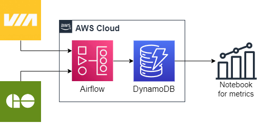

# Airflow ETL DAG for VIA and GO Transit Data

## Overview

This repository contains an Apache Airflow DAG (Directed Acyclic Graph) for performing ETL operations on VIA and GO Transit data. The DAG is designed to automate the process of extracting data from the source, transforming it, and loading it into a destination of your choice.

## Diagram

Below is a high-level diagram illustrating how the ETL process works:

## Getting Started

To get started with this project, follow these steps:

1. Clone this repository to your local machine.

2. setup your airflow this could be down locally or with cloud such as on AWS

4. setup you database, currently configured for dynamoDB but could be modified for otehr noSQL DBs 

5. Edit the DAG script (`collection.py`) to push to your database.
